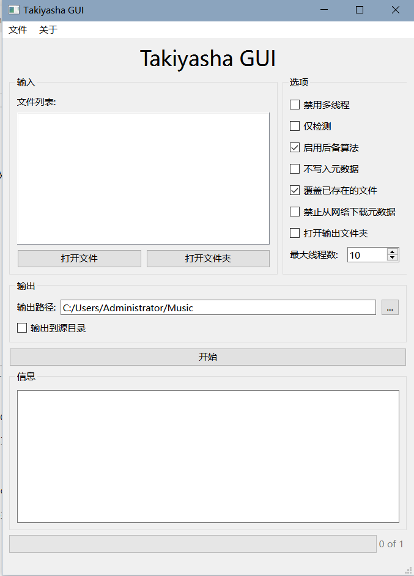

# Takiyasha GUI

TakiyashaGUI是对音乐解锁工具[takiyasha](https://github.com/nukemiko/takiyasha)的一个封装，实现了大部分命令行实现的功能。

# 屏幕截图



## 使用方法

### 1.安装依赖

```bash
pip install -r requirements.txt
```

或者

```bash
python3 -m pip install -r requirements.txt
```

### 2.编译ui文件

```bash
pyside6-uic mainform.ui -o ui_mainform.py
```

### 3.Enjoy it!

```bash
python3 main.py
```

